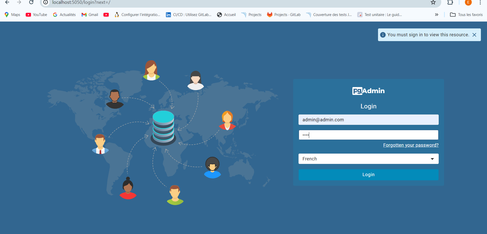

# CalculatriceProjet

## Installation et Deploiement du projet

## 1 Cloner le dépot

git clone https://github.com/soumare98/ProjetCalculatrice.git

## 2 Configuration de la Base de Données

### Système de Gestion de Base de Données

Pour ce projet j'ai utilisé PostgreSQL comme système de gestion de base de données

### Configuration de PostgreSQL

La configuration de la base de données est gérée via le fichier `docker-compose.yml`:

- **Service de base de données** :
  - **Image** : `postgres:latest` 
  - **Ports** : 
    - Le port `5432` de PostgreSQL est exposé pour permettre les connexions depuis l'extérieur du conteneur.
  - **Variables d'environnement** :
    - `POSTGRES_DB`: calculBd
    - `POSTGRES_USER`:admin
    - `POSTGRES_PASSWORD`: pass

### Configuration de pgAdmin

pgAdmin est inclus pour gérer votre base de données via une interface graphique conviviale

- **Image** : `dpage/pgadmin4` 
- **Ports** : 
  - Le port :505O
- **Variables d'environnement** :
  - `PGADMIN_DEFAULT_EMAIL`: `admin@admin.com` 
  - `PGADMIN_DEFAULT_PASSWORD`: `pass`
  

## 3 Configuration de l'environnement virtuel et installation des dépendances backend:
### Ecrire les commandes:
cd Calculatrice
python -m venv venv
source venv\Scripts\activate
pip install -r requirements.txt

## 4 Installation des dépendances frontend: 
cd ../calculatrice-front
npm install

## 4 Exécution

Pour lancer le projet avec docker , taper :

docker-compose up --build

